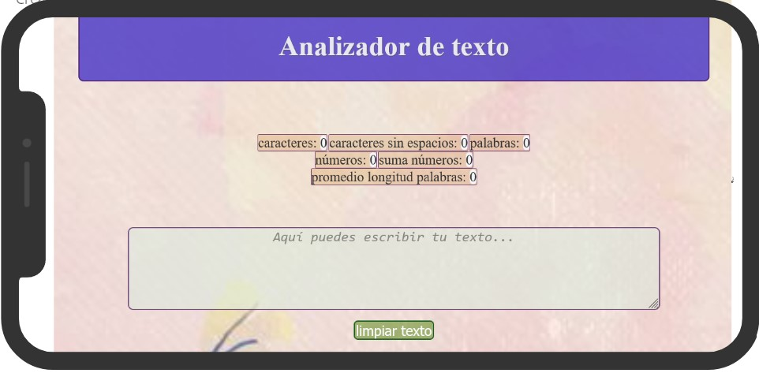

# **Analizador de texto**

### **ÍNDICE**
___
* 1. Características generales de su funcionamiento. 
* 2. Prototipo de baja fidelidad. 
* 3. Funcionamiento de las métricas. 
* 4. Funcionamiento del boton "limpiar texto".
* 5. Diseño de la aplicación.
* 6. Referencias.

____

###  **1. Características:**
___

Permite ingresar el texto de su preferencia y visualizar en tiempo real el valor de seis métricas: 
* Caracteres, 
* Caracteres sin espacios, 
* Palabras, 
* Números, 
* Suma de números y, 
* Promedio de la longitud media de las palabras.

La página contiene un encabezado con el nombre del programa, enseguida un área donde se despliega una lista de métricas y a la derecha de cada una se observa el valor conforme se va agregando texto.

Contiene recuadro de texto, donde se invita a colocar ya sea escribir o pegar el texto que se desea procesar.

Contiene un boton que limpia el área de texto.

___

### **2. Prototipo de baja fidelidad**
___

____

### **3. Funcionamiento de las métricas**
_____
Cada métrica mostrará a su derecha el resultado en tiempo real del parámetro para el cual fue diseñada, conforme se ingrese texto.
Una vez el usuario ingrese el texto que desea validar las métricas mostraran lo siguiente:

* **Caracteres**: la app cuenta el total de carateres incluyendo espacios y signos.

* **Palabras**: cuenta el numero total de palabras (por lo que tomara como palabra un conjunto de caracteres que estaran separados unos de otros por un espacio).

* **Caracteres sin espacio o signos de puntuación**:  cuenta el total de caracteres sin considerar como tal "espacios" o "signos de puntuación".

* **Números**: Cuenta el total de números que se encuentren independientes a cualquier caracteres no númerico.

* **Suma total de números**: identifica los números que son independientes a cualquier otro caracter no numerico y lo acumula, mostrando en esta métrica la suma de todos los números encontrados.

* **Longitud media de las palabras**: esta métrica cuenta el total de caracteres sin incluir espacios y la cantidad de palabras, para poder obtener el cociente de la división entre estas, el resultado obtenido sera el promedio de caracteres por palabra.

____

### **4. Funcionamiento del boton "limpiar texto".**
____

Este elemento se coloca por debajo del área de la caja texto, y nos permite vaciar la información contenida dentro de ella. Esta acción sucede cada vez que se de un click sobre este.

____

### **5. Diseño de la aplicación**

Se utilizan las reglas básicas de diseño visual 

1. Contraste en relación al encabezado y el cuerpo de la página, asi como en el color de texto.

2. En el área para introducir el texto que se desea analizar se utilizo un color mas claro para el background y un texto que resalte en contraste permitiendo que sea legible sin forzar la vista al usuario (color: #333333;)

3. El contenido principal se alinea de forma centrada junto con los demas elementos.

____
### **Referencias:**
____

*HTML SEMÁNTICO*: https://platzi.com/clases/1802-accesibilidad-web/26072-que-es-el-html-semantico-y-por-que-es-importante/

*PROPIEDADES CSS*: https://developer.mozilla.org/es/docs/Web/CSS/Using_CSS_custom_properties

*USO DE SELECTORES DEL DOM:* https://developer.mozilla.org/en-US/docs/Web/API/Document/querySelector

https://developer.mozilla.org/en-US/docs/Web/API/Document/getElementById

*MANEJO DE EVENTOS DEL DOM:*  
*KEY UP* https://developer.mozilla.org/en-US/docs/Web/API/EventTarget/addEventListener

*CLICK* https://developer.mozilla.org/en-US/docs/Web/API/EventTarget/addEventListener

*MANIPULACIÓN DINAMICA DEL DOM:*  
*INNERHTML* https://developer.mozilla.org/en-US/docs/Web/API/EventTarget/addEventListener

*JAVASCRIPT:*   
*DATOS PRIMITIVOS* https://developer.mozilla.org/es/docs/Glossary/Primitive  
*MANIPULACIÓN DE STRINGS*  
*SPLIT*    
https://developer.mozilla.org/en-US/docs/Web/JavaScript/Reference/Global_Objects/String/split   
*REPLACE*  
https://developer.mozilla.org/en-US/docs/Web/JavaScript/Reference/Global_Objects/String/replace    
*VARIABLES*  
*LET*  
https://developer.mozilla.org/en-US/docs/Web/JavaScript/Reference/Statements/let  
*CONST*  
https://developer.mozilla.org/en-US/docs/Web/JavaScript/Reference/Statements/const  
*CONDICIONALES*  
*IF...ELSE* https://developer.mozilla.org/en-US/docs/Web/JavaScript/Reference/Statements/if...else  
*BUCLES*  
*FOR* https://developer.mozilla.org/en-US/docs/Web/JavaScript/Reference/Statements/for  
*DEFINICIÓN DE FUNCIONES*  
https://developer.mozilla.org/es/docs/Web/JavaScript/Guide/Functions  
 

